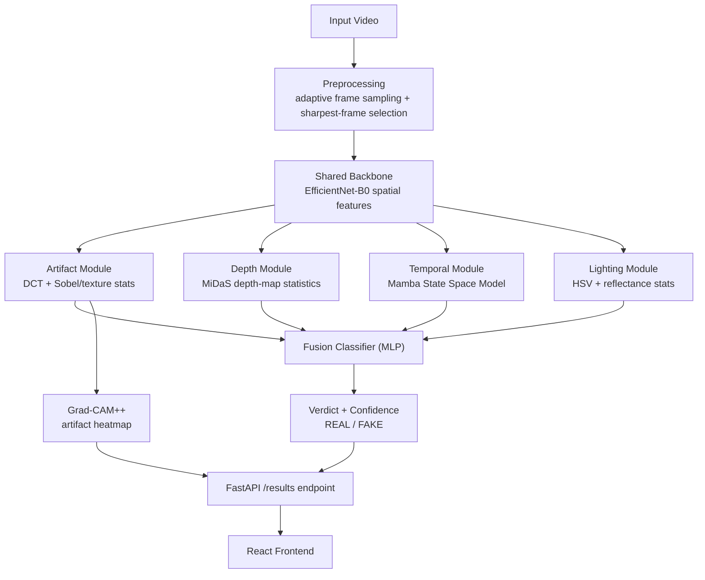

# DeepGuard-NR

**A Multimodal Deep Learning Framework for Detecting Neural Rendering Deepfakes**

DeepGuard-NR analyzes video for signs of AI-generated forgery by combining four independent forensic signals — spatial/frequency artifacts, monocular depth consistency, temporal (Mamba SSM) motion coherence, and physics-based lighting consistency — fused into a single verdict with Grad-CAM++ visual explanations.

Unlike classic 2D deepfake detectors (built around GAN face-swap artifacts), DeepGuard-NR specifically targets forgeries produced by **neural rendering pipelines** — NeRF and 3D Gaussian Splatting — which preserve geometric and multi-view consistency that older detectors assume is broken.

---

## Architecture



A temporal-branch Grad-CAM++ method exists on the model stack (`generate_temporal_overlay_sequence`) but is **not yet called** by `pipeline_service.py` — only the artifact heatmap currently reaches the API/frontend. See Limitations.

Each module outputs both a learned feature vector (fed to fusion) and a standalone interpretable score (exposed via `module_summary` for diagnostics/explainability), so a verdict is never a single opaque number.

---

## Repository Structure

```
.
├── app/
│   ├── main.py                # FastAPI app entrypoint
│   ├── api/
│   │   ├── deps.py            # auth dependency (get_current_user)
│   │   └── routes/
│   │       ├── auth.py        # register / login
│   │       ├── video.py       # upload, analyze
│   │       ├── results.py     # result retrieval
│   │       └── health.py
│   ├── core/
│   │   ├── config.py          # settings (checkpoint_path, storage dirs, etc.)
│   │   └── security.py        # JWT handling
│   ├── db/
│   │   ├── database.py
│   │   ├── models.py          # User, Video, AnalysisResult (SQLAlchemy)
│   │   └── schemas.py         # Pydantic request/response models
│   └── services/
│       ├── model_modules.py   # all 5 model classes + Grad-CAM++ generator
│       ├── pipeline_service.py# inference orchestration, heatmap generation
│       ├── dataset.py         # VideoDataset for training
│       ├── train.py           # training loop
│       ├── evaluate.py        # held-out evaluation + ablation report
│       ├── auth_service.py
│       └── video_service.py
├── models/
│   └── deepguard_nr_checkpoint.pt   # trained weights (place here — see below)
├── storage/
│   ├── uploads/                     # uploaded videos
│   └── heatmaps/<video_uuid>/       # generated Grad-CAM++ overlays
├── requirements.txt
├── Dockerfile
└── .env.example
```

---

## Requirements

- Python 3.12
- NVIDIA CUDA-capable GPU strongly recommended (CPU inference is impractically slow — MiDaS + EfficientNet + Mamba per video)
- 8 GB RAM minimum (16 GB recommended), ~50 GB free disk for model caches + dataset work

## Local Setup

```bash
git clone <this-repo>
cd deepguard-nr
pip install -r requirements.txt
```

Place your trained checkpoint at the path `app/core/config.py` expects (default: `models/deepguard_nr_checkpoint.pt`), or override via `.env`:
```
CHECKPOINT_PATH=models/deepguard_nr_checkpoint.pt
```

Run the server:
```bash
uvicorn app.main:app --reload
```

Confirm the startup log shows `Loaded trained checkpoint from ...` — if it instead shows `No trained checkpoint found ... running with untrained baseline weights`, the checkpoint path is wrong or the file is missing.

### API quick reference

| Endpoint | Method | Purpose |
|---|---|---|
| `/auth/register`, `/auth/login` | POST | account + JWT issuance |
| `/video/upload` | POST | upload a video, returns `video_id` |
| `/video/analyze` | POST | starts async analysis (background task) — returns immediately, poll `/results` |
| `/results/{video_id}` | GET | verdict, confidence, per-module scores, heatmap URLs (poll until `200`, `404` = still processing) |

---

## Training & Evaluation on Kaggle

The model was trained on Kaggle's free GPU tier (Tesla T4). These commands reflect the exact working setup after resolving real environment conflicts encountered during development — **follow the install order below**, don't `pip install -r requirements.txt` wholesale on Kaggle, since it can silently upgrade `numpy`/`scipy` and corrupt the environment (see Gotchas below).

### 1. Environment setup

```bash
pip install --no-cache-dir torch==2.8.0 torchvision==0.23.0
```

**Causal-Conv1d and Mamba SSM — build from source, no dependencies.** Both packages transitively pull in strict, sometimes unavailable version pins (`triton`, `apache-tvm-ffi`, `tilelang`, `quack-kernels`) that will otherwise upgrade or fight your NumPy/SciPy install. Building with `--no-build-isolation --no-deps --no-binary` against the exact pinned torch above avoids that entirely:

```bash
pip install causal-conv1d --no-build-isolation --no-deps --no-binary causal-conv1d --no-cache-dir
pip install mamba-ssm --no-build-isolation --no-deps --no-binary mamba-ssm --no-cache-dir
```

Then install everything else in one pass:
```bash
pip install -r requirements_rest.txt
```

Verify the environment is clean before doing anything else:
```python
import numpy, scipy, sklearn, torch
print(numpy.__version__, scipy.__version__, sklearn.__version__, torch.__version__, torch.cuda.is_available())
import mamba_ssm
print("mamba_ssm OK")
```

### 2. Build the manifest (CSV of `video_path,label`, `0=REAL`, `1=FAKE`)

```python
import csv
from pathlib import Path

rows = []
for f in Path("/path/to/real").glob("*.mp4"):
    rows.append((str(f.resolve()), 0))
for f in Path("/path/to/fake").rglob("*.mp4"):
    rows.append((str(f.resolve()), 1))

with open("/kaggle/working/manifest.csv", "w", newline="") as f:
    csv.writer(f).writerows(rows)
```

### 3. Train

```bash
python -m app.services.train \
    --manifest /kaggle/working/manifest.csv \
    --epochs 3 --lr 1e-4 --val-split 0.2 \
    --checkpoint-out /kaggle/working/checkpoints/deepguard_nr.pt \
    --save-every 10
```
Per-epoch metrics are logged to `<checkpoint_out>_metrics.jsonl`; a resume checkpoint is saved periodically and auto-cleaned on normal completion.

### 4. Evaluate on a held-out set

```bash
python -m app.services.evaluate \
    --manifest /kaggle/working/manifest_test.csv \
    --checkpoint /kaggle/working/checkpoints/deepguard_nr.pt
```
Reports per-module ablation (artifact/depth/temporal/lighting, evaluated independently) plus the fused verdict's accuracy, precision, recall, F1, AUC, and a confusion matrix.

---

## Known Kaggle Environment Gotchas

- **Never run `pip install -r requirements.txt` blind on Kaggle.** It can upgrade `numpy`/`scipy` beyond what the rest of Kaggle's preinstalled ML stack (`opencv`, `jax`, `cuml`, etc.) expects, corrupting the environment in a way that reinstalling numpy alone won't fix. Install pinned versions explicitly (Step 1 above) instead.
- **Always run training/evaluation as a background subprocess** (`subprocess.Popen(..., start_new_session=True)`), not inline in a notebook cell — a plain inline run shares the kernel's process group and can be killed by an unrelated interrupt elsewhere in the notebook.
- **`logging.basicConfig()` is a no-op after the first call in a process.** If nothing seems to log despite training running, force the level explicitly: `logging.getLogger().setLevel(logging.INFO)` after all imports.
- Check for duplicate training processes before launching a new one — `pgrep -f app.services.train` — running two against the same checkpoint file concurrently will corrupt it.

---

## Limitations

- The temporal branch's Grad-CAM++ visualization is not yet wired into `pipeline_service.py` — heatmaps are currently generated from the artifact branch only, even though the underlying temporal Grad-CAM++ method exists on the model stack.
- Artifact and lighting modules need more training data to converge reliably.
- The depth module currently uses a Sobel-gradient proxy rather than its intended MiDaS network path due to a duplicate-`forward()`-method bug — fixing this is planned future work.
- Confidence score is the raw fusion-classifier sigmoid output, not separately calibrated against empirical accuracy.

## Citation

If you use this project, please cite:
```
Prithvi Raj A, Anish Kumar G, Chiranth Gowda V N, Praveen G, Nikitha K S,
"DeepGuard-NR: A Multimodal Deep Learning Framework for Detecting Neural Rendering Deepfakes,"
Bangalore Institute of Technology, 2026.
```

## License

Add your chosen license here before publishing (e.g. MIT, Apache-2.0) — none is currently specified.
